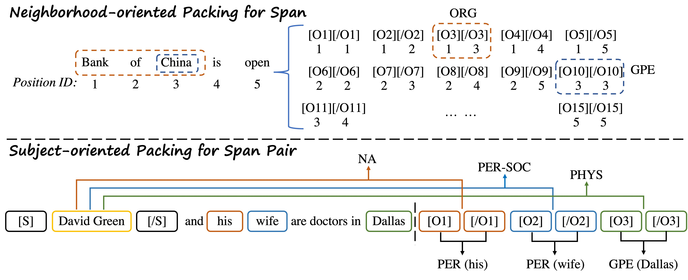

# Text2NKG
Text2NKG：Sentence-level N-ary Relation Extraction for End-to-End N-ary relational Knowledge Graph Completion

## Overview


<!-- In this work, we present a novel span representation approach, named Packed Levitated Markers,  to consider the dependencies between the spans (pairs) by strategically packing the markers in the encoder. Our approach is evaluated on two typical span (pair) representation tasks:

1. Named Entity Recognition (NER): Adopt a group packing strategy for enabling our model to process massive spans together to consider their dependencies with limited resources.

2. Relation Extraction (RE): Adopt a subject-oriented packing strategy for packing each subject and all its objects into an instance to model the dependencies between the same-subject span pairs

Please find more details of this work in our paper. -->


## Setup
### Install Dependencies

Install dependencies, The code is based on huggaface's [transformers](https://github.com/huggingface/transformers):
```
pip3 install -r requirement.txt
pip3 install --editable ./transformers
```
Then, we should install [apex](https://github.com/NVIDIA/apex). Note that the apex branch needs to conform to the environment. 

### Default implementation environment

* *linux + python3.7.13 + pytorch1.8.1 + cuda11.1*

### Download and preprocess the datasets
Our experiments are based on two datasets: HyperRED and ACE05. Please find the links and pre-processing below:
* HyperRED : 
```
python hyperred_data_process.py
```
* ACE05: 
```
python ace05_data_process.py
```

### Input data format

The input data format for our models is JSONL. Each line of the input file contains one document in the following format.
```
{
  # document ID (please make sure doc_key can be used to identify a certain document)
  "doc_key": "CNN_ENG_20030306_083604.6",
  "clusters": []

  # sentences in the document, each sentence is a list of tokens
  "sentences": [
    [...],
    [...],
    ["tens", "of", "thousands", "of", "college", ...],
    ...
  ],

  # entities (boundaries and entity type) in each sentence
  "ner": [
    [...],
    [...],
    [[26, 26, "LOC"], [14, 14, "PER"], ...], #the boundary positions are indexed in the document level
    ...,
  ],

  # relations (two spans and relation type) in each sentence
  "relations": [
    [...],
    [...],
    [[14, 14, 10, 10, "ORG-AFF", [[24, 25, "for work"]]], [14, 14, 12, 13, "ORG-AFF", [[35, 35, "for work"]]], ...],
    ...
  ]
}
```
<!-- 
### Trained Models
We release our trained n-ary RE models on HyperRED and ACE datasets on [Google Drive](https://drive.google.com/drive/folders/1k_Nt_DeKRKIRd2sM766j538b1JhYm4-H?usp=sharing). 

When processing end-to-end n-ary relational knowledge graph completion, we use PL-Marker trained NER models on [Google Drive](https://drive.google.com/drive/folders/1k_Nt_DeKRKIRd2sM766j538b1JhYm4-H?usp=sharing) and our Text2NKG trained n-ary RE models.  
-->

## Training
Download Pre-trained Language Models from [Hugging Face](https://huggingface.co/): 
```
mkdir -p bert_models/bert-base-uncased
wget -P bert_models/bert-base-uncased https://huggingface.co/bert-base-uncased/resolve/main/pytorch_model.bin
wget -P bert_models/bert-base-uncased https://huggingface.co/bert-base-uncased/resolve/main/vocab.txt
wget -P bert_models/bert-base-uncased https://huggingface.co/bert-base-uncased/resolve/main/config.json
```

Train Text2NKG n-ary RE Models:
```
python run_re.py
```
<!-- 
## N-ary RE Evaluation
The following commands can be used to run our pre-trained models on HyperRED.

Evaluate the Text2NKG n-ary RE model:

```
CUDA_VISIBLE_DEVICES=0  python3  run_re.py  --model_type bertsub  \
    --model_name_or_path  ../bert_models/scibert-uncased  --do_lower_case  \
    --data_dir scierc  \
    --learning_rate 2e-5  --num_train_epochs 10  --per_gpu_train_batch_size  8  --per_gpu_eval_batch_size 16  --gradient_accumulation_steps 1  \
    --max_seq_length 256  --max_pair_length 16  --save_steps 2500  \
    --do_eval  --evaluate_during_training   --eval_all_checkpoints  --eval_logsoftmax  \
    --fp16   \
    --test_file sciner_models/sciner-scibert/ent_pred_test.json  \
    --use_ner_results \
    --output_dir scire_models/scire-scibert
```

## F1 scores of N-ary RE tasks

| Model | HyperRED | ACE05 |
| :-----| :----: | :----: |
| TabelFilling | - | - |
| PURE | - | - |
| PL-Marker | - | - |
| CubeRE | - | - |
| Text2NKG | - | - |


## End-to-End n-ary relational KG completion
The following commands can be used to run PL-Marker pre-trained models on HyperRED.

Process the NER model:
```
CUDA_VISIBLE_DEVICES=0  python3  run_acener.py  --model_type bertspanmarker  \
    --model_name_or_path  ../bert_models/scibert-uncased  --do_lower_case  \
    --data_dir scierc  \
    --learning_rate 2e-5  --num_train_epochs 50  --per_gpu_train_batch_size  8  --per_gpu_eval_batch_size 16  --gradient_accumulation_steps 1  \
    --max_seq_length 512  --save_steps 2000  --max_pair_length 256  --max_mention_ori_length 8    \
    --do_eval  --evaluate_during_training   --eval_all_checkpoints  \
    --fp16  --seed 42  --onedropout  --lminit  \
    --train_file train.json --dev_file dev.json --test_file test.json  \
    --output_dir sciner_models/sciner-scibert  --overwrite_output_dir  --output_results
```

We need the ner result `ent_pred_test.json` from the NER model with `--output_results`. Then we process the RE model:
```
CUDA_VISIBLE_DEVICES=0  python3  run_re.py  --model_type bertsub  \
    --model_name_or_path  ../bert_models/scibert-uncased  --do_lower_case  \
    --data_dir scierc  \
    --learning_rate 2e-5  --num_train_epochs 10  --per_gpu_train_batch_size  8  --per_gpu_eval_batch_size 16  --gradient_accumulation_steps 1  \
    --max_seq_length 256  --max_pair_length 16  --save_steps 2500  \
    --do_eval  --evaluate_during_training   --eval_all_checkpoints  --eval_logsoftmax  \
    --fp16   \
    --test_file sciner_models/sciner-scibert/ent_pred_test.json  \
    --use_ner_results \
    --output_dir scire_models/scire-scibert
```
Here,  `--use_ner_results` denotes using the original entity type predicted by NER models.


## Citation
If you use our code in your research, please cite our work:
```bibtex
@inproceedings{ye2022plmarker,
  author    = {Deming Ye and
               Yankai Lin and
               Peng Li and
               Maosong Sun},
  editor    = {Smaranda Muresan and
               Preslav Nakov and
               Aline Villavicencio},
  title     = {Packed Levitated Marker for Entity and Relation Extraction},
  booktitle = {Proceedings of the 60th Annual Meeting of the Association for Computational
               Linguistics (Volume 1: Long Papers), {ACL} 2022, Dublin, Ireland,
               May 22-27, 2022},
  pages     = {4904--4917},
  publisher = {Association for Computational Linguistics},
  year      = {2022},
  url       = {https://aclanthology.org/2022.acl-long.337},
  timestamp = {Wed, 18 May 2022 15:21:43 +0200},
  biburl    = {https://dblp.org/rec/conf/acl/YeL0S22.bib},
  bibsource = {dblp computer science bibliography, https://dblp.org}
}
``` -->
