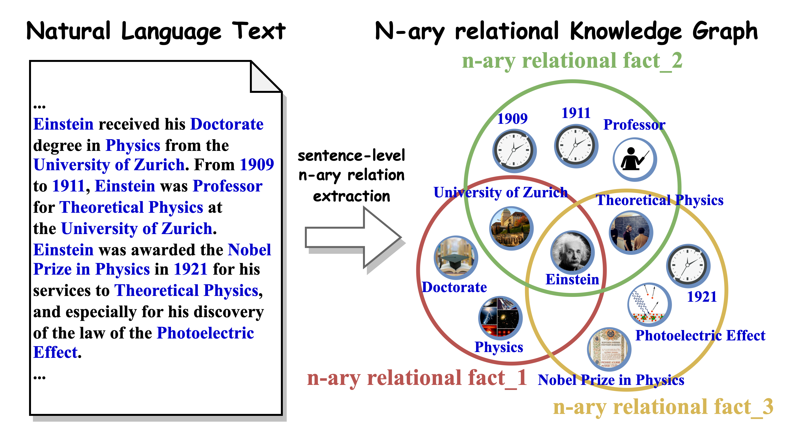
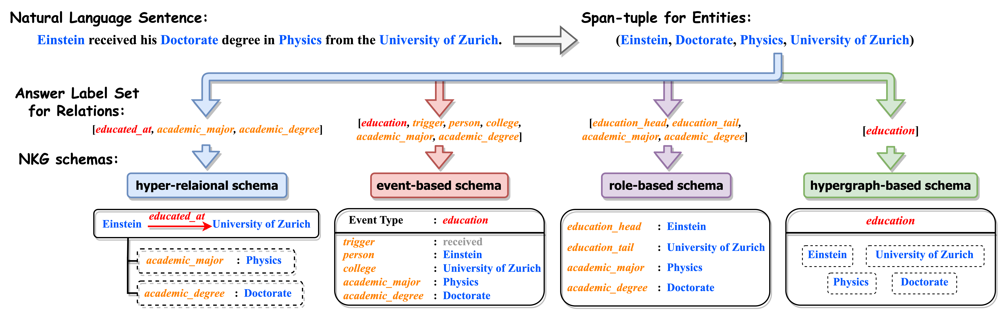
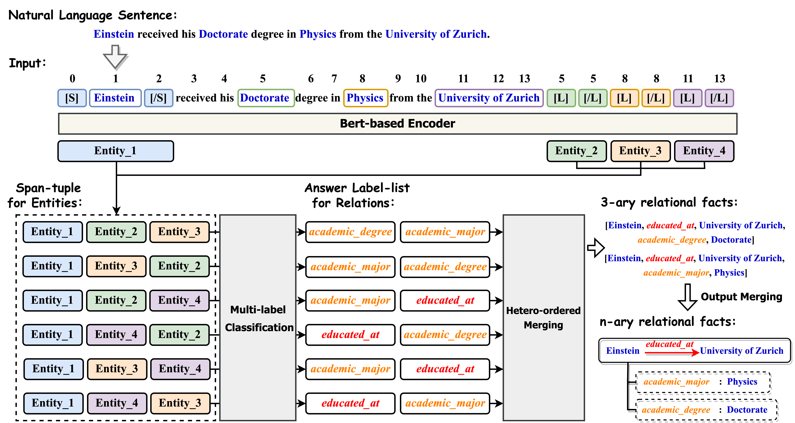

# Text2NKG
Text2NKG：Fine-Grained N-ary Relation Extraction for End-to-End N-ary relational Knowledge Graph Construction

## Overview





## Setup

### Default implementation environment

* *Linux(SSH) + Python3.7.13 + Pytorch1.8.1 + Cuda11.1*

```
pip install torch==1.8.1+cu111 torchvision==0.9.1+cu111 torchaudio==0.8.1 -f https://download.pytorch.org/whl/torch_stable.html
```

### Install Dependencies

Install dependencies, The code is based on huggaface's [transformers](https://github.com/huggingface/transformers):
```
pip install -r requirement.txt
pip install --editable ./transformers
```
Then, we should install [apex](https://github.com/NVIDIA/apex).
```
unzip apex.zip
cd apex
python setup.py install
cd ..
```

### Datasets
Our experiments are based on two datasets: HyperRED and HyperACE05. 

### Download PLMs

Download Pre-trained Language Models from [Hugging Face](https://huggingface.co/): 
```
mkdir -p bert_models/bert-base-uncased
wget -P bert_models/bert-base-uncased https://huggingface.co/bert-base-uncased/resolve/main/pytorch_model.bin
wget -P bert_models/bert-base-uncased https://huggingface.co/bert-base-uncased/resolve/main/vocab.txt
wget -P bert_models/bert-base-uncased https://huggingface.co/bert-base-uncased/resolve/main/config.json
```
```
mkdir -p bert_models/bert-large-uncased
wget -P bert_models/bert-large-uncased https://huggingface.co/bert-large-uncased/resolve/main/pytorch_model.bin
wget -P bert_models/bert-large-uncased https://huggingface.co/bert-large-uncased/resolve/main/vocab.txt
wget -P bert_models/bert-large-uncased https://huggingface.co/bert-large-uncased/resolve/main/config.json
wget -P bert_models/bert-large-uncased https://huggingface.co/bert-large-uncased/resolve/main/tokenizer.json
wget -P bert_models/bert-large-uncased https://huggingface.co/bert-large-uncased/resolve/main/tokenizer_config.json
```
## Training

Train Text2NKG n-ary RE Models:
```
python run_re.py
```
