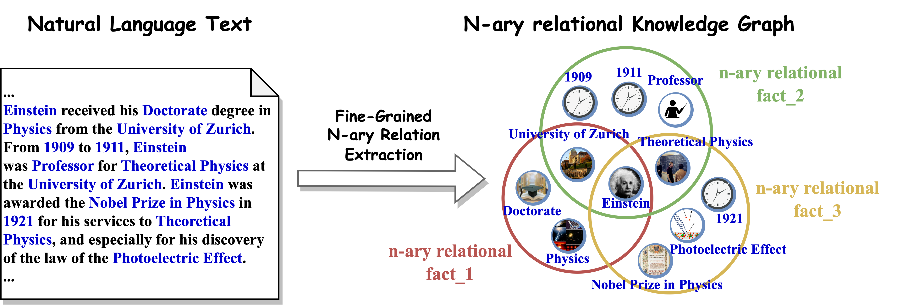
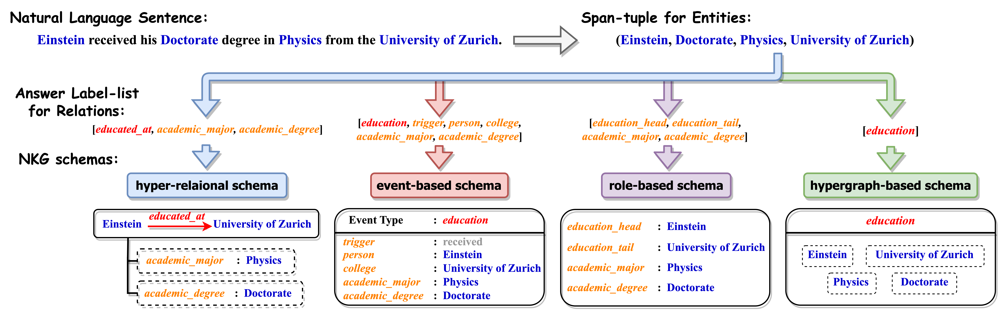

# Text2NKG

Official resources of **"Text2NKG: Fine-Grained N-ary Relation Extraction for N-ary relational Knowledge Graph Construction"**. Haoran Luo, Haihong E, Yuhao Yang, Tianyu Yao, Yikai Guo, Zichen Tang, Wentai Zhang, Shiyao Peng, Kaiyang Wan, Meina Song, Wei Lin, Yifan Zhu, Luu Anh Tuan. **NeurIPS 2024** \[[paper](https://arxiv.org/abs/2310.05185)\]. 

## Overview




## Setup

### Default implementation environment

* *Linux(SSH) + Python3.7.13 + Pytorch1.8.1 + Cuda11.1*

```
pip install torch==1.8.1+cu111 torchvision==0.9.1+cu111 torchaudio==0.8.1 -f https://download.pytorch.org/whl/torch_stable.html
```

### Install Dependencies

Install dependencies, The code is based on huggaface's [transformers](https://github.com/huggingface/transformers):
```
pip install -r requirement.txt
pip install --editable ./transformers
```
Then, we should install [apex](https://github.com/NVIDIA/apex).
```
unzip apex.zip
cd apex
python setup.py install
cd ..
```

### Datasets
Our experiments are based on HyperRED dataset. 

### Download PLMs

Download Pre-trained Language Models from [Hugging Face](https://huggingface.co/): 
```
mkdir -p bert_models/bert-base-uncased
wget -P bert_models/bert-base-uncased https://huggingface.co/bert-base-uncased/resolve/main/pytorch_model.bin
wget -P bert_models/bert-base-uncased https://huggingface.co/bert-base-uncased/resolve/main/vocab.txt
wget -P bert_models/bert-base-uncased https://huggingface.co/bert-base-uncased/resolve/main/config.json
```
```
mkdir -p bert_models/bert-large-uncased
wget -P bert_models/bert-large-uncased https://huggingface.co/bert-large-uncased/resolve/main/pytorch_model.bin
wget -P bert_models/bert-large-uncased https://huggingface.co/bert-large-uncased/resolve/main/vocab.txt
wget -P bert_models/bert-large-uncased https://huggingface.co/bert-large-uncased/resolve/main/config.json
wget -P bert_models/bert-large-uncased https://huggingface.co/bert-large-uncased/resolve/main/tokenizer.json
wget -P bert_models/bert-large-uncased https://huggingface.co/bert-large-uncased/resolve/main/tokenizer_config.json
```
## Training

Train Text2NKG n-ary RE Models:
```
python run_re.py
```

## BibTex

If you find this work is helpful for your research, please cite:

```bibtex
@misc{luo2023text2nkg,
      title={Text2NKG: Fine-Grained N-ary Relation Extraction for N-ary relational Knowledge Graph Construction}, 
      author={Haoran Luo and Haihong E and Yuhao Yang and Tianyu Yao and Yikai Guo and Zichen Tang and Wentai Zhang and Kaiyang Wan and Shiyao Peng and Meina Song and Wei Lin},
      year={2023},
      eprint={2310.05185},
      archivePrefix={arXiv},
      primaryClass={cs.AI}
}
```

For further questions, please contact: luohaoran@bupt.edu.cn.